# JSON Schema Validation in Bruno API Testing

## Table of Contents

1. [Overview](#overview)
2. [Why Schema Validation Matters](#why-schema-validation-matters)
3. [Architecture](#architecture)
4. [Implementation Details](#implementation-details)
5. [How to Use in Bruno Tests](#how-to-use-in-bruno-tests)
6. [Benefits and Use Cases](#benefits-and-use-cases)
7. [Best Practices](#best-practices)
8. [Troubleshooting](#troubleshooting)
9. [Examples](#examples)
10. [Performance Considerations](#performance-considerations)

---

## Overview

The `bruno-api-schema-validator` package provides automated JSON schema validation for API responses in Bruno API testing. It ensures that API responses conform to predefined schemas, catching structural changes and data type mismatches before they reach production.

### Key Features

- ✅ **Auto-Detection**: Automatically detects Bruno environment (no manual `bru.cwd()` needed!)
- ✅ **Zero Configuration**: Works out of the box with sensible defaults
- ✅ **Auto-Create Schemas**: Use `createSchema: true` to generate schemas on first run
- ✅ **Synchronous Validation**: Optimized for Bruno test compatibility
- ✅ **Detailed Error Reporting**: Exact mismatch locations with human-readable messages
- ✅ **Complex Structure Support**: Handles nested objects and arrays seamlessly
- ✅ **Draft-07 JSON Schema**: Standards-compliant validation

---

## Why Schema Validation Matters

### The Problem

Traditional API testing often focuses on status codes and specific field values, but misses critical structural issues:

```javascript
// ❌ Traditional approach - only checks specific values
test("User has name", function() {
  expect(jsonData.name).to.be.a("string");
});

// What if the API adds unexpected fields?
// What if nested objects change structure?
// What if array items have inconsistent schemas?
```

### The Solution

Schema validation provides **contract testing** that ensures:

1. **Response Structure Consistency**: All required fields are present
2. **Data Type Safety**: Fields maintain correct types (string, number, boolean, etc.)
3. **Array Homogeneity**: All items in arrays follow the same structure
4. **No Unexpected Fields**: Prevents API drift and breaking changes
5. **Nested Object Validation**: Validates deep object hierarchies

### Real-World Impact

| Without Schema Validation | With Schema Validation |
|---------------------------|------------------------|
| Breaking changes discovered in production | Caught immediately during testing |
| Manual inspection of each field | Automated comprehensive validation |
| Inconsistent array items go unnoticed | All array items validated uniformly |
| Type mismatches cause runtime errors | Type safety guaranteed at test time |
| API drift over time | Strict contract enforcement |

---

## Architecture

### File Structure

```
bruno-collection/
├── api-schemas/                      # Schema storage (auto-created)
│   └── jsonplaceholder/
│       ├── Users_schema.json
│       ├── Posts_schema.json
│       └── Comments_schema.json
└── tests/
    ├── GetUsers.bru
    ├── GetPosts.bru
    └── GetComments.bru
```

### Component Overview

```mermaid
graph LR
    A[Bruno Test] --> B[SchemaValidator]
    B --> C{Schema File Exists?}
    C -->|Yes| D[Load Schema]
    C -->|No| E[Auto-Create Schema]
    D --> F[Validate Response]
    E --> F
    F --> G{Valid?}
    G -->|Yes| H[Test Passes ✓]
    G -->|No| I[Detailed Error Report ✗]
```



### Auto-Detection Flow


---

## Implementation Details

### Installation

```bash
npm install bruno-api-schema-validator
```

### Core Functions

#### 1. `new SchemaValidator([schemaPathOrFolderName])`

**Purpose**: Creates a validator instance with automatic environment detection.

**Parameters**:
- `schemaPathOrFolderName` (string, optional): Default: `'api-schemas'`
  - **In Bruno**: Folder name within your collection
  - **In Node.js**: Full path to schema directory

**Examples**:

```javascript
// Bruno: Auto-detected, uses default 'api-schemas' folder
const validator = new SchemaValidator();

// Bruno: Custom folder name
const validator = new SchemaValidator('my-schemas');

// Node.js: Full path
const validator = new SchemaValidator('/absolute/path/to/schemas');
```

---

#### 2. `validateJsonSchemaSync(folderName, fileName, body, options)`

**Purpose**: Synchronously validates a JSON response against a stored schema. **Use this in Bruno tests.**

**Parameters**:
- `folderName` (string): Subdirectory path (e.g., `'jsonplaceholder'`)
- `fileName` (string): Schema file base name (e.g., `'Users'`)
- `body` (object/array): The JSON response to validate
- `options` (object, optional):
  - `createSchema` (boolean): Auto-create schema if missing. Default: `false`
  - `verbose` (boolean): Show detailed errors. Default: `true`
  - `throwOnError` (boolean): Throw on validation failure. Default: `false`

**Returns**: `boolean` - `true` if valid, `false` otherwise

**Example**:

```javascript
const isValid = validator.validateJsonSchemaSync(
  'jsonplaceholder',
  'Users',
  jsonData,
  { createSchema: true, verbose: true }
);
```

---

#### 3. `validateJsonSchema(folderName, fileName, body, options)`

**Purpose**: Asynchronously validates data against a schema. **Use this in Node.js test frameworks (Jest, Mocha, Vitest).**

> ⚠️ **Note:** Bruno doesn't support async/await in tests. Use `validateJsonSchemaSync()` for Bruno.

**Use Cases**:
- ✅ Jest/Mocha/Vitest test suites
- ✅ CI/CD validation scripts
- ✅ Node.js automation scripts
- ❌ Bruno API tests (use sync version)

**Example**:

```javascript
// Jest test example
it('validates users endpoint', async () => {
  const validator = new SchemaValidator('./api-schemas');
  const isValid = await validator.validateJsonSchema(
    'api/v1',
    'Users',
    responseData,
    { createSchema: true }
  );
  expect(isValid).toBe(true);
});
```

---

#### 4. `createJsonSchema(folderName, fileName, json)`

**Purpose**: Generates a JSON Schema from a sample JSON response.

**Schema Generation Logic**:

```javascript
// For arrays of objects, validates all items uniformly
if (Array.isArray(json) && json.length > 0) {
  schema.items = {
    type: "object",
    properties: {},
    required: []
  };
  
  // Use first item as template
  const item = json[0];
  for (const key of Object.keys(item)) {
    schema.items.properties[key] = { type: typeof item[key] };
  }
  
  schema.items.required = Object.keys(item);
}
```

**Generated Schema Example**:

```json
{
  "$schema": "http://json-schema.org/draft-07/schema#",
  "type": "array",
  "items": {
    "type": "object",
    "properties": {
      "id": { "type": "number" },
      "name": { "type": "string" },
      "username": { "type": "string" },
      "email": { "type": "string" }
    },
    "required": ["id", "name", "username", "email"]
  }
}
```

---

## How to Use in Bruno Tests

### Method 1: Auto-Create on First Run (Recommended)

```javascript
tests {
  const jsonData = res.getBody();
  const SchemaValidator = require('bruno-api-schema-validator');
  
  // Simple one-liner - auto-detects Bruno environment
  const validator = new SchemaValidator();
  
  test("Valid response JSON schema - Users", function(){
    // First run: Creates schema automatically
    // Subsequent runs: Validates against existing schema
    const result = validator.validateJsonSchemaSync(
      'jsonplaceholder',
      'Users',
      jsonData,
      { createSchema: true }  // 🎉 Auto-creates schema!
    );
    expect(result).to.equal(true);
  });
}
```

### Method 2: Pre-Generate Schema Separately

**Step 1**: Create schema manually once:

```javascript
tests {
  const jsonData = res.getBody();
  const SchemaValidator = require('bruno-api-schema-validator');
  const validator = new SchemaValidator();
  
  test("Create schema", async function(){
    await validator.createJsonSchema('jsonplaceholder', 'Users', jsonData);
    console.log('✓ Schema created successfully');
  });
}
```

**Step 2**: Use in all tests:

```javascript
tests {
  const jsonData = res.getBody();
  const SchemaValidator = require('bruno-api-schema-validator');
  const validator = new SchemaValidator();
  
  test("Valid response JSON schema - Users", function(){
    const result = validator.validateJsonSchemaSync(
      'jsonplaceholder',
      'Users',
      jsonData
    );
    expect(result).to.equal(true);
  });
}
```

---

## Benefits and Use Cases

### 1. Contract Testing

**Problem**: API changes break frontend applications unexpectedly.

**Solution**: Schema validation acts as a contract between backend and frontend.

```javascript
// Before: Frontend breaks when API adds new required field
// After: Test fails immediately, preventing deployment
test("API Contract Validation", function(){
  const result = validator.validateJsonSchemaSync('api/v1', 'Users', jsonData);
  expect(result).to.equal(true);
});
```

### 2. Regression Detection

**Problem**: Refactoring inadvertently changes response structure.

**Solution**: Schema validation catches structural regressions.

```javascript
// Detects when refactoring changes:
// - Field names (name → userName)
// - Data types (id: string → id: number)
// - Nested structures
// - Array item schemas
```

### 3. Documentation as Code

**Problem**: API documentation becomes outdated.

**Solution**: Schema files serve as living documentation.

```bash
# Schema file = Self-documenting API contract
bruno-collection/api-schemas/jsonplaceholder/Users_schema.json
```

### 4. Multi-Environment Consistency

**Problem**: Different environments return different response structures.

**Solution**: Same schema validates all environments (DEV, TEST, ACC, PROD).

```javascript
test("Schema consistent across environments", function(){
  const result = validator.validateJsonSchemaSync('api/v1', 'Users', jsonData);
  expect(result).to.equal(true);
});
```

### 5. Array Uniformity Validation

**Problem**: API returns arrays with inconsistent item structures.

**Solution**: Schema validates all array items against same template.

```javascript
// Without schema: Check each of 100 items manually
for (let i = 0; i < jsonData.length; i++) {
  expect(jsonData[i]).to.have.keys('id', 'name', 'email');
  // ... repeat for every field
}

// With schema: ✅ One line validates all items!
validator.validateJsonSchemaSync('api', 'Users', jsonData);
```

---

## Best Practices

### 1. Schema Organization

```
bruno-collection/
├── api-schemas/
│   ├── users/
│   │   ├── GetAllUsers_schema.json
│   │   ├── GetUserById_schema.json
│   │   └── CreateUser_schema.json
│   ├── posts/
│   │   ├── GetAllPosts_schema.json
│   │   └── GetPostById_schema.json
│   └── comments/
│       └── GetComments_schema.json
```

**Naming Convention**: `{Action}{Resource}_schema.json`

### 2. Schema Versioning

```javascript
// Include API version in folder structure
api-schemas/
├── v1/
│   └── users/
└── v2/
    └── users/
```

### 3. Test Placement Order

```javascript
tests {
  const jsonData = res.getBody();
  const SchemaValidator = require('bruno-api-schema-validator');
  const validator = new SchemaValidator();
  
  // 1. Schema validation FIRST - catches structural issues
  test("Valid JSON schema", function(){
    const result = validator.validateJsonSchemaSync('api', 'Users', jsonData, {
      createSchema: true
    });
    expect(result).to.equal(true);
  });
  
  // 2. Status code checks
  test("Status code is 200", function () {
    expect(res.getStatus()).to.equal(200);
  });
  
  // 3. Specific business logic validations
  test("At least one user returned", function () {
    expect(jsonData.length).to.be.greaterThan(0);
  });
}
```

### 4. Custom Schema Folder Names

```javascript
// Use domain-specific naming
const validator = new SchemaValidator('contract-schemas');
const validator = new SchemaValidator('api-contracts');
const validator = new SchemaValidator('response-schemas');
```

### 5. Error Handling

```javascript
test("Schema validation with error handling", function(){
  try {
    const result = validator.validateJsonSchemaSync('api', 'Users', jsonData);
    expect(result).to.equal(true);
  } catch (error) {
    console.error("Schema validation failed:", error.message);
    expect.fail("Schema validation error occurred");
  }
});
```

---

## Troubleshooting

### Issue 1: "ENOENT: no such file or directory"

**Symptom**: Cannot find schema file.

**Solution**: Use `createSchema: true` to auto-generate:

```javascript
const result = validator.validateJsonSchemaSync(
  'jsonplaceholder',
  'Users',
  jsonData,
  { createSchema: true }  // ✅ Auto-creates missing schema
);
```

---

### Issue 2: Schema Validation Fails Unexpectedly

**Symptom**: Test fails even though response looks correct.

**Debug Steps**:

1. **Enable Verbose Mode**:

```javascript
const result = validator.validateJsonSchemaSync('api', 'Users', jsonData, {
  verbose: true  // Shows detailed error messages
});
```

2. **Check Console Output**:

```
✗ SCHEMA VALIDATION ERRORS:
  Schema: api/Users
  File: C:\...\api-schemas\api\Users_schema.json

  1. At /0/id: must be string
     Expected type: string
     Actual value: 12345
```

3. **Inspect Schema File**:

```bash
cat bruno-collection/api-schemas/api/Users_schema.json
```

4. **Regenerate Schema** (if API changed legitimately):

```javascript
await validator.createJsonSchema('api', 'Users', jsonData);
```

---

### Issue 3: Schema Too Strict

**Symptom**: Validation fails because schema doesn't allow `null` values or optional fields.

**Solution**: Manually edit schema to add flexibility:

```json
{
  "type": "object",
  "properties": {
    "address": {
      "type": ["object", "null"]  // ← Allow null
    },
    "phone": {
      "type": "string"
    }
  },
  "required": ["phone"]  // ← address is optional
}
```

---

### Issue 4: Test Not Appearing in Bruno Test Tab

**Symptom**: Console shows validation result, but test doesn't appear in UI.

**Cause**: Using async/await in Bruno tests (not supported).

**Solution**: Use `validateJsonSchemaSync` (synchronous):

```javascript
// ❌ Wrong - async doesn't work in Bruno
test("Schema validation", async function(){
  const result = await validator.validateJsonSchema(...);
});

// ✅ Correct - synchronous
test("Schema validation", function(){
  const result = validator.validateJsonSchemaSync(...);
});
```

---

## Examples

### Example 1: JSONPlaceholder Users API

**API Response**:

```json
[
  {
    "id": 1,
    "name": "Leanne Graham",
    "username": "Bret",
    "email": "Sincere@april.biz",
    "address": {
      "street": "Kulas Light",
      "city": "Gwenborough",
      "zipcode": "92998-3874"
    }
  }
]
```

**Bruno Test** (`GetUsers.bru`):

```javascript
meta {
  name: Get Users
  type: http
  seq: 1
}

get {
  url: https://jsonplaceholder.typicode.com/users
  body: none
  auth: none
}

tests {
  const jsonData = res.getBody();
  const SchemaValidator = require('bruno-api-schema-validator');
  const validator = new SchemaValidator();
  
  test("Valid response JSON schema - Users", function(){
    const result = validator.validateJsonSchemaSync(
      'jsonplaceholder',
      'Users',
      jsonData,
      { createSchema: true }
    );
    expect(result).to.equal(true);
  });
  
  test("Status code is 200", function () {
    expect(res.getStatus()).to.equal(200);
  });
  
  test("Response is an array", function () {
    expect(jsonData).to.be.an("array");
  });
}
```

**Generated Schema** (`api-schemas/jsonplaceholder/Users_schema.json`):

```json
{
  "$schema": "http://json-schema.org/draft-07/schema#",
  "type": "array",
  "items": {
    "type": "object",
    "properties": {
      "id": { "type": "number" },
      "name": { "type": "string" },
      "username": { "type": "string" },
      "email": { "type": "string" },
      "address": { "type": "object" }
    },
    "required": ["id", "name", "username", "email", "address"]
  }
}
```

---

### Example 2: Multiple Endpoints with Shared Structure

**Scenario**: Testing multiple related endpoints.

```javascript
// GetAllUsers.bru
test("Users schema", function(){
  const result = validator.validateJsonSchemaSync('api/v1', 'Users', jsonData);
  expect(result).to.equal(true);
});

// GetActiveUsers.bru
test("Active users schema", function(){
  const result = validator.validateJsonSchemaSync('api/v1', 'Users', jsonData);
  expect(result).to.equal(true);
});

// SearchUsers.bru
test("Search results schema", function(){
  const result = validator.validateJsonSchemaSync('api/v1', 'Users', jsonData);
  expect(result).to.equal(true);
});
```

**Benefit**: Single schema maintains consistency across all related endpoints.

---

### Example 3: Nested Object Validation

**API Response**:

```json
{
  "user": {
    "id": 123,
    "profile": {
      "name": "John Doe",
      "location": {
        "city": "Berlin",
        "country": "Germany"
      }
    }
  }
}
```

**Bruno Test**:

```javascript
test("Nested object schema validation", function(){
  const result = validator.validateJsonSchemaSync(
    'users',
    'UserProfile',
    jsonData,
    { createSchema: true }
  );
  expect(result).to.equal(true);
});
```

---

### Example 4: CI/CD Integration (Node.js)

**File**: `scripts/validate-contracts.js`

```javascript
const SchemaValidator = require('bruno-api-schema-validator');
const fetch = require('node-fetch');

async function validateAllEndpoints() {
  const validator = new SchemaValidator('./schemas');
  
  const endpoints = [
    { url: '/api/users', schema: 'Users' },
    { url: '/api/posts', schema: 'Posts' },
    { url: '/api/comments', schema: 'Comments' }
  ];
  
  for (const endpoint of endpoints) {
    console.log(`Validating ${endpoint.url}...`);
    
    const response = await fetch(API_BASE + endpoint.url);
    const data = await response.json();
    
    const isValid = await validator.validateJsonSchema(
      'api/v1',
      endpoint.schema,
      data,
      { throwOnError: true }  // Fail CI if invalid
    );
    
    console.log(`✓ ${endpoint.schema} validated successfully`);
  }
}

validateAllEndpoints()
  .then(() => console.log('✅ All contracts validated'))
  .catch(err => {
    console.error('❌ Contract validation failed:', err);
    process.exit(1);
  });
```

**CI/CD Pipeline** (`.github/workflows/test.yml`):

```yaml
name: API Contract Tests

on: [push, pull_request]

jobs:
  validate-contracts:
    runs-on: ubuntu-latest
    steps:
      - uses: actions/checkout@v3
      - uses: actions/setup-node@v3
        with:
          node-version: '18'
      - run: npm install
      - run: npm run validate-contracts
```

---

## Comparison: With vs Without Schema Validation

### Traditional Testing Approach

```javascript
tests {
  var jsonData = res.getBody();
  
  // Test 1: Check array
  test("Response is an array", function () {
    expect(jsonData).to.be.an("array");
  });
  
  // Test 2: Check each user has required keys
  test("Check User properties", () => {
    for (let i = 0; i < jsonData.length; i++) {
      expect(jsonData[i]).to.have.keys('id', 'name', 'username', 'email');
    }
  });
  
  // Test 3: Check types
  test("Check types", function () {
    for (let i = 0; i < jsonData.length; i++) {
      expect(jsonData[i].id).to.be.a("number");
      expect(jsonData[i].name).to.be.a("string");
      expect(jsonData[i].username).to.be.a("string");
      expect(jsonData[i].email).to.be.a("string");
    }
  });
  
  // Test 4: Check unique IDs
  test("User IDs are unique", function () {
    let ids = jsonData.map(u => u.id);
    let uniqueIds = Array.from(new Set(ids));
    expect(ids.length).to.equal(uniqueIds.length);
  });
  
  // ... 10+ more tests for complete coverage
}
```

**Issues**:
- 🔴 Verbose and repetitive (50+ lines)
- 🔴 Doesn't catch unexpected fields
- 🔴 Hard to maintain across multiple endpoints
- 🔴 Doesn't validate nested objects thoroughly
- 🔴 Manual effort to check all properties

### Schema Validation Approach

```javascript
tests {
  const jsonData = res.getBody();
  const SchemaValidator = require('bruno-api-schema-validator');
  const validator = new SchemaValidator();
  
  // Single comprehensive test
  test("Valid response JSON schema - Users", function(){
    const result = validator.validateJsonSchemaSync(
      'jsonplaceholder',
      'Users',
      jsonData,
      { createSchema: true }
    );
    expect(result).to.equal(true);
  });
  
  // Optional: Business-specific tests
  test("At least one user returned", function () {
    expect(jsonData.length).to.be.greaterThan(0);
  });
}
```

**Benefits**:
- ✅ Concise and maintainable (10 lines vs 50+)
- ✅ Catches structural changes automatically
- ✅ Reusable across endpoints
- ✅ Validates entire response structure
- ✅ Catches unexpected fields
- ✅ Deep nested validation
- ✅ Auto-creates schemas on first run

---

## Performance Considerations

### Validation Speed

- **Synchronous validation**: ~10-50ms for typical responses
- **Async validation**: ~20-100ms (includes file I/O)
- **Schema compilation**: Cached by AJV after first use

### Memory Usage

- **Minimal**: Schema files are small (typically <10KB)
- **Efficient**: AJV uses compiled validators for speed

### Best Practices for Large Responses

```javascript
// For responses with 1000+ items, consider sampling
test("Schema validation (sampled)", function(){
  const sample = jsonData.slice(0, 100); // Validate first 100 items
  const result = validator.validateJsonSchemaSync('api', 'LargeData', sample);
  expect(result).to.equal(true);
});
```

---

## Conclusion

Schema validation in Bruno API testing provides:

1. **Automated Contract Testing**: Ensures API responses match expected structure
2. **Regression Detection**: Catches breaking changes before deployment
3. **Living Documentation**: Schema files document API contracts
4. **Reduced Test Code**: One schema validation replaces dozens of manual checks
5. **Confidence**: Comprehensive validation of entire response structure

### Getting Started Checklist

- [ ] Install `bruno-api-schema-validator`: `npm install bruno-api-schema-validator`
- [ ] Create your first Bruno test with schema validation
- [ ] Use `{ createSchema: true }` to auto-generate schemas
- [ ] Run tests and verify they pass
- [ ] Commit schema files to version control
- [ ] Add schema validation to all critical endpoints
- [ ] Document schema structure in team wiki

### Next Steps

1. Extend schema validation to all critical endpoints
2. Integrate with CI/CD pipeline using async methods
3. Create schema versioning strategy (v1/, v2/ folders)
4. Train team on schema maintenance
5. Set up alerts for schema violations

---

## Additional Resources

- **Package**: [bruno-api-schema-validator on npm](https://www.npmjs.com/package/bruno-api-schema-validator)
- **Repository**: [GitHub - Vikaseneco/api-schema-validator](https://github.com/Vikaseneco/api-schema-validator)
- [JSON Schema Specification](https://json-schema.org/)
- [AJV Validator Documentation](https://ajv.js.org/)
- [Bruno API Client](https://www.usebruno.com/)
- [Contract Testing Best Practices](https://martinfowler.com/bliki/ContractTest.html)

---

**Package**: bruno-api-schema-validator  
**Author**: Vikas Yadav  
**Last Updated**: October 23, 2025  
**Version**: 1.1.0  
**License**: MIT
